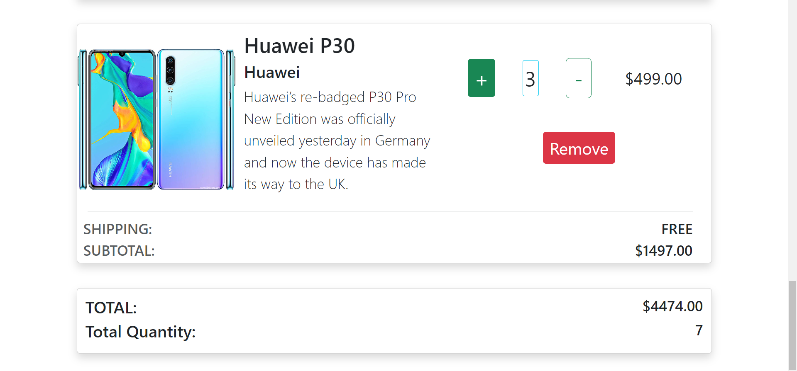

### Create a Shopping Cart using Redux  ###   
 Create a cart page with per-item price, per-item quantity, Total quantity and total amount.   

 ### How the Cart page works ###   
 1. There will be some Products in the cart page .   
 2. If wanted , you can increase or decrease the quantity of the each product or you can remove the product from the cart using tghe remove button.   
 3. In the bottom of the page , you can able to see the total Amout for the products including the the total quantity will be shown  and the total quantity also be shown.   

 For more Details , Check the below image   

